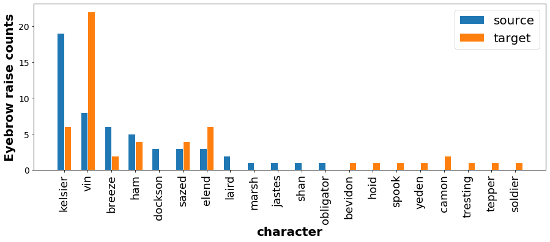
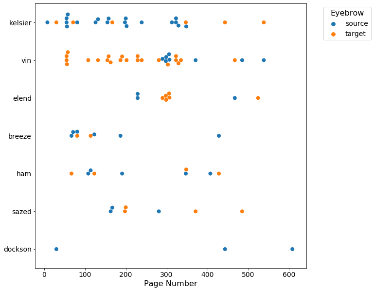

# Mistborn: The Final Eyebrow

Below is a compilation of visualizations analyzing the social dynamics in the first Mistborn book based on the number of times characters "raise an eyebrow" at another character. The full article describing the pilot analysis is available here {ADD LINK}.

## Visualization gallery

### Book 1: The Final Empire

    <table>
        <tr>
            <td>
                
Interactive

            </td>
            <td>
                <a href="viz/fe_eyebrow_conn_int.html" title="Go to interactive visualization" display='inline'>
                    
                    
Eyebrow exchanges over time - interactive

                </a>
            </td>
            <td>
                <a href="viz/fe_net.html" title="Go to interactive visualization" display='inline'>
                    
                    
Eyebrow social network

                </a>
            </td>
        </tr>
        <tr>
            <td>
                
Static

            </td>
            <td>
                <a href="viz/fe_counts.html" title="Go to static visualization" display='inline'>
                    
                    
Total eyebrow raiser/raisee counts

                </a>
            </td>
            <td>
                <a href="viz/fe_swarm.html" title="Go to static visualization" display='inline'>
                    
                    
Eyebrow exchanges over time - static

                </a>
            </td>
        </tr>
    </table>

### Book 2: The Well of Ascension

    <table>
        <tr>
            <td>
                
Interactive

            </td>
            <td>
                <a href="viz/wa_eyebrow_conn_int.html" title="Go to interactive visualization" display='inline'>
                    
                    
Eyebrow exchanges over time - interactive

                </a>
            </td>
            <td>
                <a href="viz/wa_net.html" title="Go to interactive visualization" display='inline'>
                    
                    
Eyebrow social network

                </a>
            </td>
        </tr>
        <tr>
            <td>
                
Static

            </td>
            <td>
                <a href="viz/wa_counts.html" title="Go to static visualization" display='inline'>
                    
                    
Total eyebrow raiser/raisee counts

                </a>
            </td>
            <td>
                <a href="viz/wa_swarm.html" title="Go to static visualization" display='inline'>
                    
                    
Eyebrow exchanges over time - static

                </a>
            </td>
        </tr>
    </table>

### Book 3: The Hero of Ages

    <table>
        <tr>
            <td>
                
Interactive

            </td>
            <td>
                <a href="viz/ha_eyebrow_conn_int.html" title="Go to interactive visualization" display='inline'>
                    
                    
Eyebrow exchanges over time - interactive

                </a>
            </td>
            <td>
                <a href="viz/ha_net.html" title="Go to interactive visualization" display='inline'>
                    
                    
Eyebrow social network

                </a>
            </td>
        </tr>
        <tr>
            <td>
                
Static

            </td>
            <td>
                <a href="viz/ha_counts.html" title="Go to static visualization" display='inline'>
                    
                    
Total eyebrow raiser/raisee counts

                </a>
            </td>
            <td>
                <a href="viz/ha_swarm.html" title="Go to static visualization" display='inline'>
                    
                    
Eyebrow exchanges over time - static

                </a>
            </td>
        </tr>
    </table>

### The entire first era trilogy

    <table>
        <tr>
            <td>
                <a href="viz/mb_counts.html" title="Go to static visualization" display='inline'>
                    
                    
Total eyebrow raiser/raisee counts

                </a>
            </td>
            <td>
                <a href="viz/mb_net.html" title="Go to interactive visualization" display='inline'>
                    
                    
Eyebrow social network

                </a>
            </td>
        </tr>
    </table>

