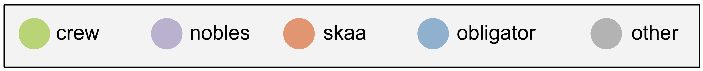

# The Final Empire - social network

* Nodes are sized proportional to the total eyebrow interactions (source + target)
* Edges are sized by total eyebrow interactions from the source to the target
* Drag nodes to reorganize network

<iframe width="100%" height="684" frameborder="0"
  src="https://observablehq.com/embed/ea523a627b98997b?cell=fe_chart"></iframe>